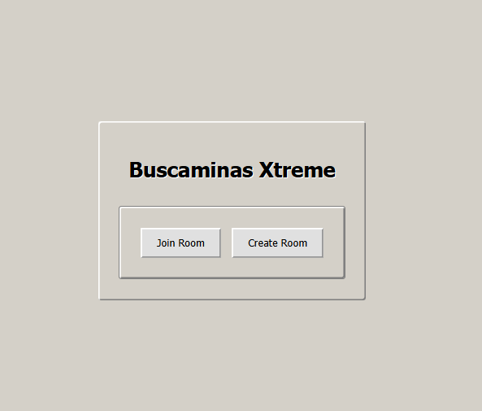
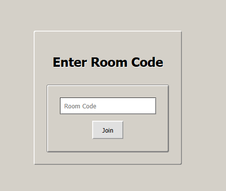
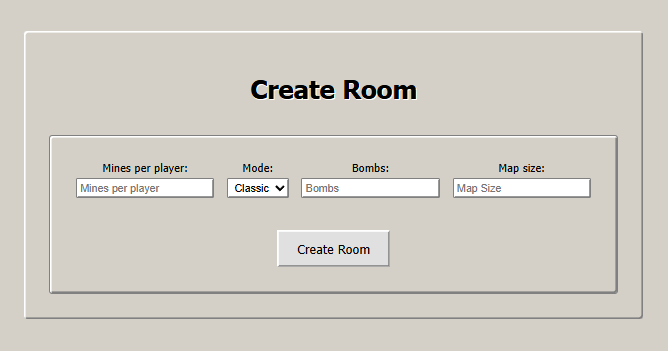

# BuscaminasXtreme Frontend

This module is the **graphical user interface (GUI)** for the **BuscaminasXtreme** project. It allows users to play, view the game board in real time, and communicate via voice and chat. It connects to two backend modules:

- **GameService:** Handles game logic, match management, and players.
- **VoiceService:** Enables voice and text communication between players.

---

## Features

- Create and join game rooms.
- Real-time board visualization and updates.
- Player movement and action controls.
- Flagging cells and placing mines.
- Integrated text chat and voice communication.
- Synchronization with backend via WebSockets and REST.

---

## Project Structure

- `src/components/`: Reusable visual components (board, cell, forms, etc.).
- `src/pages/`: Main application views (Home, Game, Join, etc.).
- `src/hooks/`: Custom hooks for game logic, chat, and voice.
- `src/styles/`: CSS files and style modules.

---

## Installation

1. Clone the repository.
2. Install dependencies:
    - npm install
3. Start the application:
    - npm run dev

---

## Configuration

- The frontend connects by default to the following backend services:
    - GameService: `http://44.202.248.197:8080`
    - VoiceService: (configurable depending on deployment)

You can modify the URLs in the hooks according to your environment.

---

## Usage

- Access the interface at `http://localhost:5173` (or your configured port).
- Create or join a room.
- Play and communicate with other users in real time.

---

## Main Dependencies

- React
- SockJS and StompJS (WebSocket)
- Vite (dev server and build)
- Others: see `package.json`

---

## Views

### Home

### Join Room

### Create Room

### Game Board

## Author

Developed by David Alfonso Barbosa Gomez for the BuscaminasXtreme team.